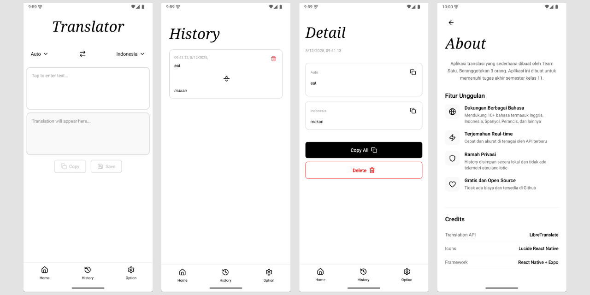

# The Translator - Aplikasi Penerjemah Berbasis React Native

    
# Tentang Aplikasi

**The Translator** adalah aplikasi penerjemah berbasis **React Native** yang menggunakan berbagai penyedia API:

- **MyMemory**
- **Lingva**
- **LibreTranslate**

Aplikasi ini dibuat untuk memberikan pengalaman terjemahan yang cepat, simpel, dan tanpa mengorbankan privasi pengguna.

Dikembangkan sebagai **tugas akhir semester** oleh tim beranggotakan tiga orang.


## Fitur Utama

- 🔓 **Open Source** — bebas dimodifikasi dan dikembangkan oleh siapa saja  
- 🔐 **Privacy-Friendly** — riwayat disimpan secara *local*, tanpa telemetri  
- ⚡ **Performa Cepat** — UI responsif menggunakan React Native + Expo  
- 📱 **User-Friendly** — desain sederhana dan mudah digunakan  
- 🌍 **Multi-Source Translation** — support beberapa layanan API

---

# Preview 



---

# Cara Build Aplikasi

## 1. Prasyarat

Pastikan lingkungan pengembangan sudah terpasang:

- **Expo environment**
- **EAS CLI**
- **Node.js**


## 2. Instruksi Build

Clone repositori:

```sh
git clone https://github.com/vinitkanov/translate_reactnative.git
```

Masuk ke directory :

```sh
cd translate_reactnative
```
Install dependencies:

```sh
npm install
```

Build untuk **Android**:

```sh
eas build -p android
```

Build untuk **iOS**:

```sh
eas build -p ios
```


# Perhatian

Aplikasi ini dibuat untuk tujuan edukasi.
Pengembang tidak bertanggung jawab atas segala bentuk penyalahgunaan.
